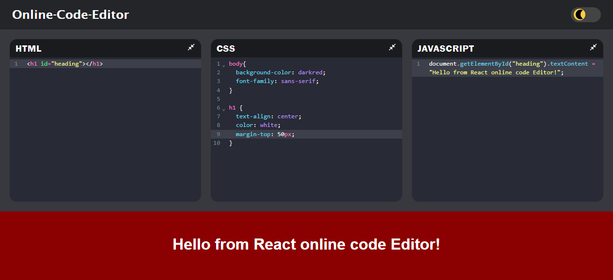

# 🖊️ Online Code Editor

A sleek, browser-based code editor built with **React** and **Vite**, supporting live HTML, CSS, and JavaScript preview. Designed for quick testing, learning, and sharing code on the fly.



---

## ✨ Features

- 🔄 **Live Preview**: Instantly see your HTML, CSS, and JS output
- 💾 **Auto Save**: Your code stays saved in the browser
- 🌓 **Light/Dark Mode**: Toggle between light and dark themes
- 🧠 **React Hooks**: Uses `useState`, `useEffect`, and `useLocalStorage`
- 🛠️ **Modular Components**: Clean file structure and reusable editor component
- ⚡ **Vite-Powered**: Fast dev experience

---

## 📦 Tech Stack

| Frontend   | Tooling     |
|------------|-------------|
| React      | Vite        |
| JavaScript | ESLint      |
| HTML/CSS   | LocalStorage |

---

## 🚀 Getting Started

```bash
# Clone the repo
git clone https://github.com/MaidaSyed/online-code-editor.git
cd online-code-editor

# Install dependencies
npm install

# Start the dev server
npm run dev

